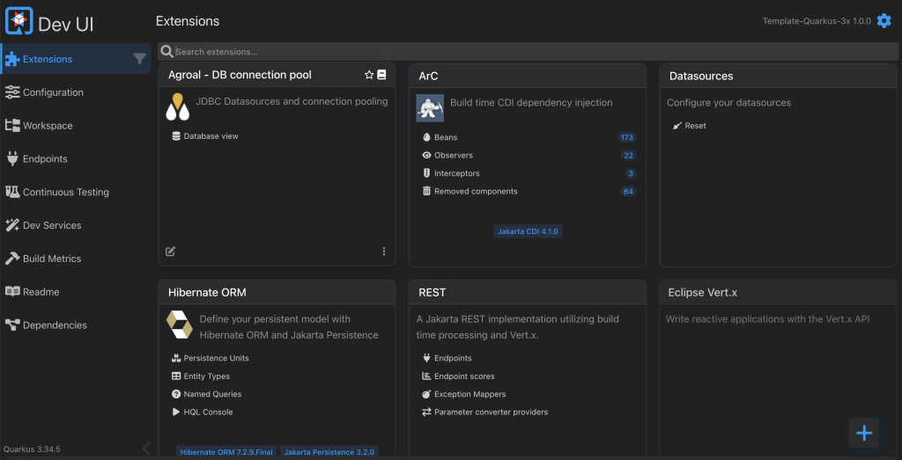
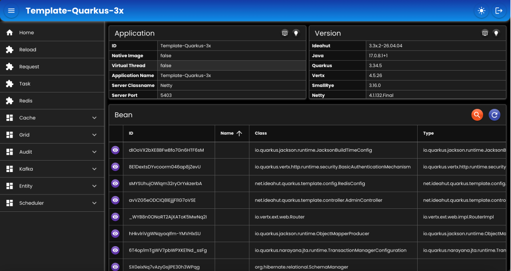

# Template Quarkus 3x&nbsp;&nbsp;&nbsp;

### [Dokumentasi](https://github.com/ideahut-apps-team/Ideahut-Quarkus)

##

|Artifact|Quarkus|
|:---------:|:----------:|
|__ideahut-quarkus-3x__|<small>(wajib di semua quarkus versi 3)</small>|
|ideahut-quarkus-3.3x.1|__3.30.0 - 3.31.4__|
|ideahut-quarkus-3.3x.2|__3.32.0 - Terbaru__|

##

### Untuk mencoba versi Quarkus tertentu:
* Rename pom-3.xx.x.xml menjadi menjadi __pom.xml__.
    ```yaml
    pom-3.3x.1.xml
    pom-3.3x.2.xml
    ```
* Pastikan artifact yang digunakan sesuai dengan versi Quarkus (lihat tabel artifact di atas).
* Edit file __pom.xml__ dengan mengubah versi __'quarkus.platform.version'__ sesuai dengan versi yang diinginkan.
    ```xml
    <properties>
        ...

        <quarkus.platform.version>3.34.5</quarkus.platform.version> <!-- Ubah bagian ini -->

        ...

    </properties> 
    ```

##

### Untuk mencoba database tertentu:
* Ubah properties __'quarkus.profile'__ sesuai dengan database yang diinginkan.
    ```yaml
    quarkus:
        #profile: 'db2'
        #profile: 'h2'
        #profile: 'mariadb'
        profile: 'mysql'
        #profile: 'oracle'
        #profile: 'postgresql'
        #profile: 'sqlserver'
    ```
* Edit file __'application-{profile}.yaml'__, pastikan host, port, username, dan password sesuai dengan server database yang digunakan.
    ```yaml
    application-db2.yaml
    application-h2.yaml
    application-mariadb.yaml
    application-mysql.yaml
    application-oracle.yaml
    application-postgresql.yaml
    application-sqlserver.yaml
    ```
* Aktifkan __dependency__ JDBC Driver di __pom.xml__. Contoh: jika menggunakan PostgreSQL, maka aktifkan bagian ini:
    ```xml
    <!-- POSTGRESQL -->
    <!--
    <dependency>
        <groupId>io.quarkus</groupId>
        <artifactId>quarkus-jdbc-postgresql</artifactId>
    </dependency>
    -->
    ```
* Beberapa __dependency__ tidak diaktifkan, agar proses _build_ __Native Image__ tidak terlalu lama dan tidak mengkonsumsi memori terlalu besar.

##

### Mode Development
* Untuk menjalankan aplikasi dalam mode development (_hot reload_).
    ```shell
    mvn clean quarkus:dev \
    -Dquarkus.config.locations=application.yaml \
    -Dideahut.system.properties=file:ideahut.properties
    ```
* Dev UI dapat diakses di <http://localhost:5403/q/dev/>.
    <div align="left">
    
    </div>
##

### Membuat Native Image
* Pastikan [Patch 3x](https://github.com/ideahut-apps-team/Patch-Quarkus-3x) sudah diimplementasi. Dan tambahkan di _build arguments_:
    ```xml
    <profiles>
        <profile>
            <id>native</id>
        </profile>
        ...
        <properties>
            ...
            <quarkus.native.additional-build-args>
                ...
                --initialize-at-build-time=net.ideahut.quarkus.template,
                --initialize-at-build-time=net.ideahut.quarkus.template.config.WebConfig$ResponseFilter_ClientProxy,
                --initialize-at-build-time=net.ideahut.quarkus.template.config.WebConfig$RequestFilter_ClientProxy
            </quarkus.native.additional-build-args>
            ...
        </properties>
        ...
    </profiles>
    ```
* Download GraalVM dari salah satu tautan berikut:
    * [GraalVM](https://www.graalvm.org/downloads/)
    * [Bellsoft](https://bell-sw.com/pages/downloads/native-image-kit/)
    * [Mandrel](https://github.com/graalvm/mandrel/releases)
* Setup environment variable, seperti berikut:
    ```shell
    export GRAALVM_HOME=/Library/Java/JavaVirtualMachines/aarch64/bellsoft-liberica-vm-full-openjdk25-25.0.1/Contents/Home
    export JAVA_HOME=$GRAALVM_HOME
    export MAVEN_HOME=/opt/macdev/maven/3.9.9
    export PATH=$PATH:$GRAALVM_HOME/bin:$MAVEN_HOME/bin
    ```
* Masuk ke directory project.
    ```shell
    cd ./Template-Quarkus-3x
    ```
* Compile dan package.
    ```shell
    mvn \
    -Dmaven.compiler.target=25 \
    -Dmaven.compiler.source=25 \
    -Dmaven.compiler.release=25 \
    -Djava.version=25 \
    -Dquarkus.package.type=uber-jar \
    clean compile package
    ```
* Mengumpulkan metadata untuk __Native Image__. Ganti __'{profile}'__ dengan database yang digunakan. 
    ```shell
    $JAVA_HOME/bin/java \
    -Dquarkus.aot.enabled=true \
    -Dquarkus.config.locations=application.yaml,application-{profile}.yaml \
    -Dideahut.system.properties=file:ideahut.properties \
    -agentlib:native-image-agent=config-merge-dir=./src/main/resources/META-INF/native-image \
    -jar target/Template-Quarkus-3x-1.0.0-runner.jar
    ```
* Menggabungkan _serialization_ ke metadata.
    ```shell
    $JAVA_HOME/bin/java \
    -cp target/Template-Quarkus-3x-1.0.0-runner.jar \
    net.ideahut.quarkus.template.config.NativeConfig
    ```
* Membuat __Native Image__.
    ```shell
    mvn \
    -Dmaven.compiler.target=25 \
    -Dmaven.compiler.source=25 \
    -Dmaven.compiler.release=25 \
    -Djava.version=25 \
    clean compile package -Pnative -X
    ```
##

### Admin
* `URL`  : http://localhost:5403/_/web
* `User` : admin
* `Pass` : password
<div align="left">
   
</div>

##

### Template

* [Quarkus 3x](https://github.com/ideahut-apps-team/Template-Quarkus-3x)

##

### Patch
* [Patch 3x](https://github.com/ideahut-apps-team/Patch-Quarkus-3x)
